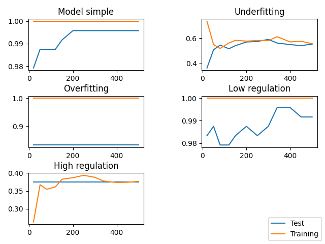

# M2 DLAD Stat3 Machine learning project

## Analyze
* This data collection corresponds to a portion of the PANCAN RNA-Seq(HiSeq) data
* This is a gene expression extraction of patients with different tumor types:
- BRCA
- PRAD
- LUAD
- KIRC
- COAD
* We count 800 samples (rows)
* 20,531 genetic expressions (columns)
* Each gene expression is measured by the Illumina HiSeq sequencing platform

* We made a model with a deep logistic regression with simulations of the cases where the model is perfectible

* Then a short analysis with a neural network to compare the optimal model

## Dependencies

### Miniconda
```{}
wget https://repo.anaconda.com/miniconda/Miniconda3-latest-Linux-x86_64.sh
chmod +x Miniconda3-latest-Linux-x86_64.sh
./Miniconda3-latest-Linux-x86_64.sh
source .bashrc
conda create -n stat3
conda activate stat3
```

### Installation packages for analysis
```{}
conda install -c conda-forge pandas
conda install -c conda-forge scikit-learn
conda install -c conda-forge keras tensorflow
```

### Unzip data
```{}
unzip data.zip
```

## Launch projet
```{}
python3 main.py
```



